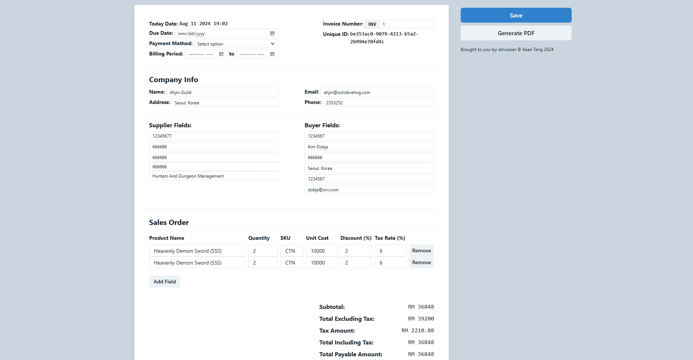
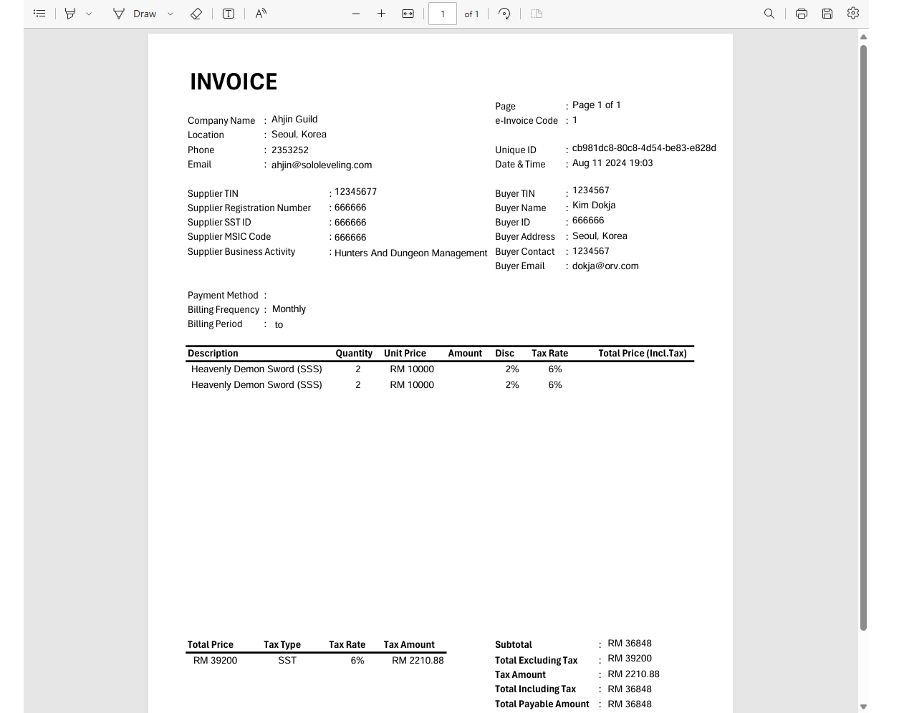

# eInvoicer - For Invoice Production  <!-- omit in toc -->


An Invoice generating application build with NextJS and powered by [react-hook-form](https://react-hook-form.com/), [chakra-ui](https://v2.chakra-ui.com/) and [pdf-lib](https://pdf-lib.js.org/) to improve the effectiveness of invoice production. 

The invoice contains all the required fields required for digital verification by [Lembaga Hasil Dalam Negeri](https://www.hasil.gov.my/en/e-invoice/) for the enhancement of tax administration management. The implementation of e-Invoice is also in line with the Government plan to strengthen the digital services infrastructure. 

The app makes uses of `pdf-lib`, a javascript package to capture data from the invoice form and convert it to a PDF document. The display of the PDF document generated make use of `iframe` and can be viewed on any chromium browser.

**Table of Contents:**
- [Live Demo](#live-demo)
- [Preview](#preview)
- [Getting Started](#getting-started)
- [Roadmap](#roadmap)


## Live Demo

## Preview


## Getting Started

To run it locally:

```
git clone https://github.com/keanteng/einvoicer
```

On terminal, 
```bash
npm run dev
# or
yarn dev
```

## Roadmap
- [ ] Currency picker
- [ ] Usage of API for:
  - Storing invoice in a database
  - Request data to generate PDF document
